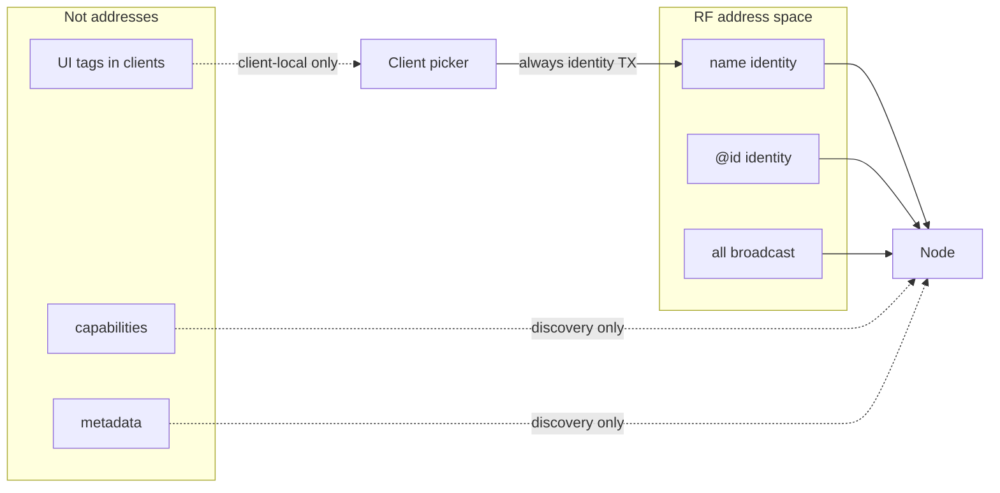

# RFC-0001 — mcRPC 1.1: Identity, capabilities, and discovery metadata

| Field | Value |
|-------|--------|
| **RFC** | 0001 |
| **Title** | mcRPC 1.1 — identity addressing and capability metadata |
| **Status** | **Accepted** — Revision **03** (architecture frozen) |
| **Protocol today** | **1.1** (GA) — 1.0 remains the stable wire floor |
| **Target** | Protocol **1.1** (additive where practical) |
| **Created** | 2026-08-06 |
| **Revised** | 2026-08-06 (rev 03 — encoding rules; product-neutral examples) |
| **Implements** | GA: mcrpc `1.1.0`, MeshCore `mcrpc-1.1.0`, meshcore-ha `2.11.0` (Android Phase 4 = specification only) |

All examples in this document are **generic**. They do not describe any
particular deployment, product branding, or operator node names.

---

## Abstract

mcRPC 1.0 examples treat tokens like `ha` and `tracker` as request **targets**.
That conflates convenient UI labels with on-air addressing and does not scale to
multiple automation hubs, buttons, or GPS units on one channel.

**Rev 02+** simplifies the long-term model (rev 03 = encoding lock-down):

| On the wire (addressing) | Meaning |
|--------------------------|---------|
| **Identity name** | `node1 ping` |
| **Identity id** | `@3CBB ping` (client short form of full `id=`) |
| **Broadcast** | `all ping` |

| In discovery / UI (not addresses) | Meaning |
|-----------------------------------|---------|
| **Capabilities** | `caps=battery,display,gps` — canonical CSV (see §5.5) |
| **Metadata** | `fw`, `board`, `vendor`, `transport`, `protocol`, `features`, `uptime`, … |
| **Optional UI tags** | `tag=` (preferred) or legacy `profile=` — **never RF targets** |

**Roles are not a protocol addressing concept.** Firmware and the mcRPC parser
do not match requests by role. Clients (Home Assistant, Android, CLI, …) MAY
group devices by local or advertised tags, then always transmit an **identity**
target on RF.

Implementations SHOULD maintain backward compatibility with Protocol 1.0 where
practical. Migration details: [`COMPATIBILITY.md`](../protocol/COMPATIBILITY.md)
and §14.

**Architecture is frozen.** This RFC does not invite new protocol features.

---

## 1. Architecture diagram

```text
┌──────────────────────────────────────────┐
│                 Node                     │
│                                          │
│  Identity                                │
│    name     = node1                      │
│    id       = 3CBBF74E  →  @3CBB         │
│    aliases? = room-a,room-b (future)     │
│                                          │
│  Capabilities                            │
│    gps, battery, display, button, …      │
│                                          │
│  Metadata                                │
│    fw, board, vendor, transport,         │
│    protocol*, features*, auth*, uptime*  │
└──────────────────────────────────────────┘
                    │
                    │ discovery advertises identity + caps + metadata
                    ▼
┌─────────────┐  RF targets only   ┌─────────────────────┐
│ Clients     │ ───────────────►   │ node1 │ @id │ all   │
│ (HA, …)     │   (never "ha")     └─────────────────────┘
│             │
│ UI may tag  │  tag=ha → list[node1, node2]
│ devices     │  then TX: node1#42 ping
└─────────────┘
```



---

## 2. Core vocabulary

### 2.1 Identity (addressable)

| Field | Wire | Purpose |
|-------|------|---------|
| **name** | Transport / discovery subject | Primary human address: `node1 ping` |
| **id** | `id=` **full** hex in discovery; address `@` + hex | Device **always emits the full id**. Clients MAY address with a unique prefix (`@3CBB`). |
| **aliases** | future `aliases=` | Extra names for the same node — later 1.x / client-side; not required in 1.1 parser |

Identity is the **only** unicast address space.

### 2.2 Capabilities (never addresses)

Functional surface only:

```text
gps  battery  relay  display  button  temperature  humidity  mqtt  wifi  …
```

Discovery:

```text
caps=battery,display,gps
```

Canonical CSV rules for `caps=` (and `features=`): see §5.5.

Clients ask: “does this node do GPS?” — they do **not** send `gps ping`.
Commands stay identity-scoped: `node1 gps`.

### 2.3 Metadata (never addresses)

```text
fw=  board=  vendor=  transport=  auth=  uptime=
protocol=  protocol_min=  protocol_max=  sdk=  features=
tag=          ; preferred UI hint (1.1)
profile=      ; legacy 1.0 only — do not promote in new emitters
```

Plus any future informational `key=value` (SPEC forward compatibility).

### 2.4 UI tags — not protocol addressing

| Field | Status | Use |
|-------|--------|-----|
| **`tag=`** | **Preferred** for 1.1 | Soft UI/grouping hint (`tag=ha`). Not an address. |
| **`profile=`** | **Legacy 1.0** | Accept/read for compatibility. New implementations SHOULD NOT promote it. MAY emit beside `tag=` during transition. |
| **`roles=`** | Not required | Do not introduce; use `tag=` or client-local tags. |

**Tags are not a protocol addressing concept.** Firmware does not match requests
by tag. Clients MAY group by `tag=` or local labels, then always TX identity.

### 2.5 Service (deferred)

No fourth addressable axis. Fold into capabilities or metadata (`transport=`,
`auth=`). Revisit only for concrete gateway endpoint lifecycles (separate RFC).

---

## 3. Addressing (normative intent for 1.1)

### 3.1 Exactly three recommended target forms

| Kind | Example | Meaning |
|------|---------|---------|
| Identity name | `node1 ping` | Unicast to that node name |
| Identity id | `@3CBB ping` / `@3CBBF74E ping` | Unicast by stable id |
| Broadcast | `all ping` | Every listening node may answer |

Also retain 1.0 **`self`** and **`group:<name>`** as reserved forms (unchanged).

### 3.2 Explicitly not addresses

| Token class | Example (do not send) |
|-------------|------------------------|
| UI / legacy profile label | `ha ping`, `gateway status`, `tracker gps` |
| Capability | `button ping`, `gps ping`, `battery ping` |

### 3.3 Node id syntax — `@` only; full emit, short address OK

| Form | Status |
|------|--------|
| Discovery `id=` | **Full** hex id always (device MUST emit complete value) |
| `@3CBBF74E` | Full-id address — always valid |
| `@3CBB` | Client **MAY** use a unique prefix of the full id |
| `#A31C` as target | **Reject** — collides with request-id |

**Rule:** the device is the source of truth for the full id string. Clients
shorten only after consulting discovery cache (prefix must uniquely identify one
cached node; if ambiguous, use full `@id` or name).

Request id remains glued digits on the identity token (unchanged — §7):

```text
node1#123 ping
```

### 3.4 Legacy Named tokens

Protocol 1.0 still parses any first identifier as `Named`. A device whose
**name** is literally `ha` will answer `ha ping` by **identity**, not by tag.
New clients and docs must not rely on that pattern.

---

## 4. Why not role addressing (decision record)

| Approach | Verdict |
|----------|---------|
| Role on RF (`ha ping`) | **Rejected** in rev 02 |
| All role holders answer / ambiguous_target / priority | Obsolete with rejection |
| Client maps tag → identity list, TX identity | **Adopted** |

Benefits of identity-only RF:

- Firmware ignores tags for dispatch.
- One mental model for humans and golden tests.
- Client completions = discovery identities (+ `all`).
- Future `aliases=` extend identity without new address kinds.

---

## 5. Discovery as source of truth

After `discovery` / `all discovery`, a client SHOULD be able to build a device
model without mandatory extra RF round-trips.

### 5.1 Recommended 1.1 discovery content

```text
node1 id=3CBBF74E fw=1.3.4 board=devboard1 vendor=example uptime=86400
  protocol=1.1 protocol_min=1.0 protocol_max=1.1 sdk=1.1.0
  caps=battery,display,mqtt auth=psk transport=meshcore
  features=caps-in-discovery,id-addr,request-id
  tag=ha
```

| Group | Fields | Notes |
|-------|--------|-------|
| **Identity** | name (subject), `id=` **full** | `id=` recommended; always full length when present |
| **Capabilities** | `caps=` CSV | Canonical form §5.5; `caps` command for overflow |
| **Metadata** | `fw`, `board`, `vendor`, `transport`, `auth`, `uptime`, `protocol*`, `sdk`, `features` | `uptime=` recommended |
| UI hint | `tag=` preferred; `profile=` legacy | Informational only — **not an address** |
| Future | `aliases=` | Identity aliases — later |

### 5.2 1.0 gap

1.0 required only `profile= fw= protocol= sdk=` after the name — insufficient
for a full model. 1.1 fills identity id + caps + metadata (+ `tag=` / `uptime=`)
additively. Readers SHOULD treat legacy `profile=` like a UI tag if `tag=` is
absent.

### 5.3 Size

Prefer one transport-limited line; if `caps=` must truncate, set a clear marker
and allow `caps` command to complete the list. Never drop 1.0-required keys when
still emitting a 1.0-compatible shape.

### 5.4 Client discovery cache

Cache per full `id` (else `name`): caps, fw, board, uptime, protocol*, features,
auth, transport, `tag=` / legacy `profile=`, plus any purely local UI tags.
Refresh on discovery.

### 5.5 Canonical CSV encoding (`caps=`, `features=`)

Normative for **new 1.1 emitters** (golden tests SHOULD assume this):

1. **Lowercase** tokens (ASCII).
2. **No duplicates**.
3. **Sorted alphabetically** (byte / ASCII order).
4. Comma-separated, **no spaces**.

```text
; correct
caps=battery,display,gps
features=caps-in-discovery,id-addr,request-id

; incorrect for 1.1 emitters
caps=gps,battery
caps=battery,battery,gps
features=request-id, id-addr
features=Request-Id,id-addr
```

Receivers MUST still accept non-canonical CSV from Protocol 1.0 / transitional
peers (split on comma, trim, case-fold for comparison). Golden vectors for 1.1
**emit** the canonical form only.

---

## 6. Capabilities

- Mean **functionality only**.
- Listed in discovery (`caps=`) and/or `caps` command.
- Never used as RF targets.
- Client automations: select identity where `'gps' in caps`, then `node1 gps`.

---

## 7. Request ID — no format change

```text
node1#123 ping
→ #123 pong   (or name-prefixed transport form)
```

Trailing `node1 ping #123` is **out of scope** for this RFC.

---

## 8. Responses and Chat readability

Default on-wire replies stay human-readable (`pong`, `ok`, `status …`,
`err busy`, …).

Optional **response envelope** (`ok command=…`) only behind an explicit feature
for API/gateway clients — **not** the default Chat shape.

---

## 9. Errors

Additive codes as needed (`bad_request`, aliases, …). Mesh nodes remain
**silent** when the identity target is not them. No role-based
`ambiguous_target` on RF (tags are not addresses).

---

## 10. Version and feature negotiation

```text
protocol=1.1
protocol_min=1.0
protocol_max=1.1
features=caps-in-discovery,id-addr,request-id
```

`features=` MUST follow §5.5.

| Token (illustrative) | Meaning |
|----------------------|---------|
| `request-id` | Glued `#digits` correlation |
| `id-addr` | Understands `@hex` targets |
| `caps-in-discovery` | Advertises `caps=` on discovery |
| `response-envelope` | Optional API envelope |
| `aliases` | Future: understands `aliases=` / alias TX |

Clients ignore unknown feature tokens.

---

## 11. Events

Keep 1.0 event names. Prefer structured `event type=button …` when advertised
(`features=event-v2`) — additive.

---

## 12. Status

```text
status name=node1 board=devboard1 fw=1.3.4 uptime=… battery=… caps=… rssi=…
```

---

## 13. Aliases (future door, not 1.1 requirement)

```text
aliases=room-a,room-b
```

- **Client-side:** map alias → canonical name before TX.
- **On-device (later):** answer to alias tokens as additional **identity** names.

Aliases extend **identity**, not a new address kind.

---

## 14. Compatibility and migration (pointer)

> Implementations SHOULD maintain backward compatibility with Protocol 1.0
> where practical.

Details: [`COMPATIBILITY.md`](../protocol/COMPATIBILITY.md).

### 14.1 Informative migration sketch

1. Docs / UX: teach `node1 ping` / `@id` / `all` — not `ha ping`.
2. Clients: tag filters in UI; RF builders emit identity only.
3. Parsers: add `@id`; do not add tag/role match.
4. Discovery: full `id=`, canonical `caps=` / `features=`, `uptime=`, `tag=`;
   MAY keep legacy `profile=` temporarily.
5. Firmware: Named name match; optional `@id` match on full id (accept unique
   client prefix); no tag dispatch.
6. Devices literally **named** `ha` keep working as identity `ha` until renamed.

---

## 15. Impact matrix

| Topic | Firmware | HA client | Mobile Chat | CLI |
|-------|----------|-----------|-------------|-----|
| Address space | name, `@id`, all | TX identity / all only | Same | Same |
| Tags | Ignore for dispatch | UI filters only | Optional | Optional |
| Capabilities | Advertise; never as target | Filter automations | Show caps | Show caps |
| Request id | Unchanged glued | Unchanged | Unchanged | Unchanged |
| Discovery SoT | Rich metadata + caps | Cache | Contacts | Print |

---

## 16. Scenarios

### 16.1 One automation-hub-tagged node

**Discovery:**

```text
node1 id=3CBBF74E fw=1.3.4 board=devboard1 uptime=86400 tag=ha
  caps=battery,display,mqtt protocol=1.1 …
  features=caps-in-discovery,id-addr,request-id
```

| Send | OK? |
|------|-----|
| `node1 ping` | yes |
| `@3CBBF74E ping` | yes — full id |
| `@3CBB ping` | yes — if unique in client cache |
| `all discovery` | yes |
| `ha ping` | not a 1.1 protocol target |
| `battery ping` | no |

**Client UI:** filter `tag=ha` → shows `node1` → sends `node1 ping`.

---

### 16.2 Two nodes with the same tag

```text
node1 id=3CBBF74E tag=ha caps=battery,display …
node2 id=A31C9F00 tag=ha caps=battery …
```

**Client UI:** tag `ha` → list `[node1, node2]`.  
**RF:** `node1 ping` or `node2 ping` — never `ha ping`.

---

### 16.3 Three button-capable sensors

```text
sensor1 caps=battery,button …
sensor2 caps=button …
sensor3 caps=button …
```

Address by **name**. Filter by capability in the client. Never `button ping`.

---

### 16.4 Two GPS trackers

```text
tracker1 id=… caps=battery,gps tag=tracker …
tracker2 id=… caps=battery,gps tag=tracker …
```

`tracker1 gps` / `@id gps` — not `gps ping`, not `tracker gps` as protocol.

---

### 16.5 Gateway-class node

```text
gateway1 id=… caps=display,mqtt,wifi transport=meshcore auth=psk tag=gateway …
```

Identity TX only. `tag=gateway` is UI sugar — never `gateway status` as protocol.

---

### 16.6 Mobile Chat client

Completions: discovery names + `@id` short forms + `all`.  
Optional local favorites/tags. Request id: `name#n`. No tag target chip.

---

### 16.7 CLI

```text
mcrpc send -t node1 ping
mcrpc send -t @3CBB status
mcrpc send -t all discovery
mcrpc nodes --cap gps          # client-side filter from cache
```

---

## 17. Non-goals

- Role / profile / capability **addressing**
- Changing request-id placement
- `#hex` node ids
- Chat default response envelope
- First-class Service axis
- Glob multi-target (v2 candidate)
- Implementation inside this RFC document

---

## 18. Success criteria

1. RF address space = **name | @id | all** (plus legacy self/group) — **locked**.
2. Capabilities and UI tags are **not** addresses — **locked**.
3. Discovery carries identity + caps + metadata (+ `uptime=`) as SoT.
4. Clients map any tag UX to identity before TX.
5. Device emits **full** `id=`; clients MAY use unique `@` prefix.
6. `caps=` / `features=` canonical CSV (§5.5).
7. Prefer `tag=` over promoting `profile=`.
8. Request-id format unchanged; `#` reserved for request-id.
9. Compatibility details in COMPATIBILITY.md — not product mandates here.

**Architecture is feature-complete.** Further work is SPEC text, tests, and
phased implementation — not model changes.

---

## 19. References

- `docs/protocol/SPEC.md`
- `docs/protocol/COMPATIBILITY.md`
- `docs/rfc/IMPLEMENTATION_PLAN-RFC-0001.md`
- `docs/homeassistant/ANDROID_REQUEST_ID_RENDERING.md` (request-id UX note)
- Reference parser: `src/Parser.cpp` (`#` + digits → request id)

---

## 20. Revision history

| Rev | Date | Notes |
|-----|------|-------|
| 00 | 2026-08-06 | Initial; discouraged profile-as-address |
| 01 | 2026-08-06 | Role addressing retained (later rejected) |
| 02 | 2026-08-06 | Drop role addressing; identity/`@id`/`all` only |
| 03 | 2026-08-06 | Encoding rules (`tag=`, CSV, full id, `uptime=`); **product-neutral examples** |

---

## 21. Open questions (implementation defaults — not architecture)

1. Transition: emit both `tag=` and `profile=` for one minor, or `tag=` only?
2. Minimum hex length guidance for unique `@` prefixes in client UX?
3. Exact truncation marker when `caps=` does not fit one packet?
4. Client-only aliases first vs waiting for on-device `aliases=`?

Architecture decisions from rev 02+ are **closed**.

---

## Appendix A — Decision table (rev 03)

| Topic | Decision |
|-------|----------|
| `node1 ping` | Identity — **yes** |
| `@` + full / unique prefix | Identity id — **yes**; device emits **full** `id=` |
| `all ping` | Broadcast — **yes** |
| `ha` / `gateway` / `tracker` as target | **No** (protocol) |
| `button` / `gps` as target | **No** — use `node1 gps` |
| `tag=` | Preferred UI hint |
| `profile=` | Legacy only — do not promote |
| `caps=` / `features=` | Lowercase, unique, alpha-sorted CSV |
| `uptime=` | Recommended discovery metadata |
| Request id | Keep `name#123` |
| Response envelope | API optional only |
| Architecture further churn | **Stop** — feature-complete |

---

*End of RFC-0001 rev 03 (feature-complete, product-neutral). Implementation: see
`IMPLEMENTATION_PLAN-RFC-0001.md`.*
